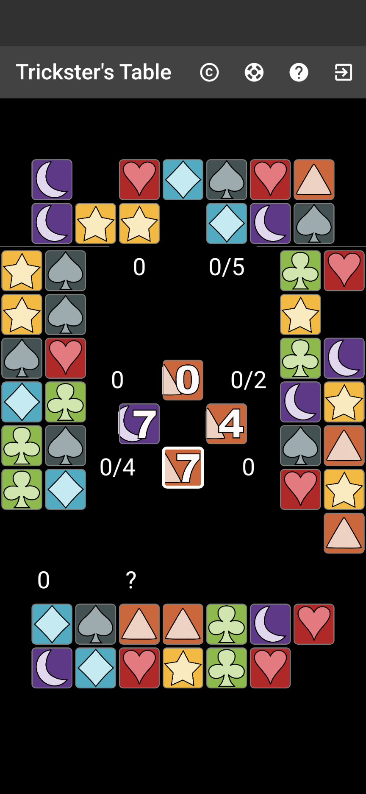

## Magic Trick Rules Engine

`magictrick` is an implementation of the game Magic Trick by Chris Wray. Chris has agreed to allow me (Dan Bravender) to release the source code for this engine. The game rules for Magic Trick were created by Chris Wray, all rights reserved.

This library along with a proprietary UI for the game, is included in Trickster's Table, an app that allows users to play licensed implementations of modern trick taking games. See below for more information about Trickster's Table.

## Trickster's Table



Trickster's Table is funded by donations through Patreon: https://www.patreon.com/TrickstersTable and Ko-fi: https://ko-fi.com/tricksterstable 50% of donations are shared with designers/rights holders of games that appear in the app (divided by play time) and 50% of donations are used to fund the development of new games.

The app is free and has no ads or microtransactions!

* Android: https://play.google.com/store/apps/details?id=app.playagame.tiger
* iOS: https://apps.apple.com/us/app/tricksters-table/id1668506875

Hopefully, this implementation of `magictrick` can be used to learn how to implement game engines for tabletop games generally, and, as a reference for how to implement new games in the Trickster's Table app.

## Plans

* [Card mockups](planning/magictrick-mockups.svg)
* [App mockup](planning/horizontal-magic-trick.png)
* [Neural network plans](planning/neural-network.md)

## Principles

* Every object (e.g. card) and every possible move should have a single unique ID. This helps when encoding inputs and decoding outputs from the neural network. Unique IDs are also useful when manipulating the user interface. In some games (such as Cat in the Box) there are identical copies of the same card but they still need to have a unique ID so the correct card is moved.

    Card IDs from `magictrick`:
    ```dart
    /// For the UI each game element must have a unique ID
    int id = 0;
    for (var suit in Suit.values) {
      reverseLookup[suit] = {};
      for (var value = 0; value <= 7; value++) {
        Card card = Card(
          id: id++,
          value: value,
          suit: suit,
        );
        deck.add(card);
        reverseLookup[card.suit]![card.value] = card.id;
      }
    }
    ```

    In most card games the order of the hand does not matter and the value of cards in a player's hand is known to that player. However, there is a level of indirection for action IDs in `magictrick` because the value of the cards in each player's hand is unknown until a card is played. Because of this, action IDs are offsets into the hand.

* Animations are handled using lists of declarative change objects:

    This change moves a card to a player's hand:

    ```dart
    Change(
        type: ChangeType.deal,
        objectId: card.id,
        dest: Location.hand,
        player: player,
        handOffset: handOffset,
        handLength: handLength,
    )
    ```

    Each `Game` has a `List<List<Change>>` `changes` property. While the engine is updating the game state it's adding new `changes`. Each sublist animates simultaneously.

    ⚠️ The UI layer should never access the game state. All information needed to make a change has to be included when the engine outputs the change. When a change is rendered the game state might not have all the information needed to render a given change. For example, when a hand is over, trying to find the index of a card in a player's hand will not work because the game state will contains the cards for the next hand.

* Each `Game` must implement the `GameState` interface:

    ```dart
    abstract class GameState<MoveType, PlayerType> {

      /// Return an independent copy of the current game state with the selected move applied
      GameState<MoveType, PlayerType> cloneAndApplyMove(
        MoveType move, Node<MoveType, PlayerType>? root);

      /// All possible moves that can be made from the current state
      List<MoveType> getMoves();

      /// Determine hidden state based on known information
      GameState<MoveType, PlayerType>? determine(
        GameState<MoveType, PlayerType>? initialState);

      /// The player that won the current round
      PlayerType? winner;

      /// The player whose turn it is
      PlayerType? currentPlayer;
    }

    ```
    Once the above interface is implemented, and you have implemented a UI (text-based first to get quick feedback about the implementation) you can play the game against an MCTS-based AI. Furthermore, you can train a neural net to play the game by running a few commands. The [neural network encoding document](planning/neural-network.md) explains the encoding and shows the commands that were run to train the AI that appears in the Trickster's Table.
